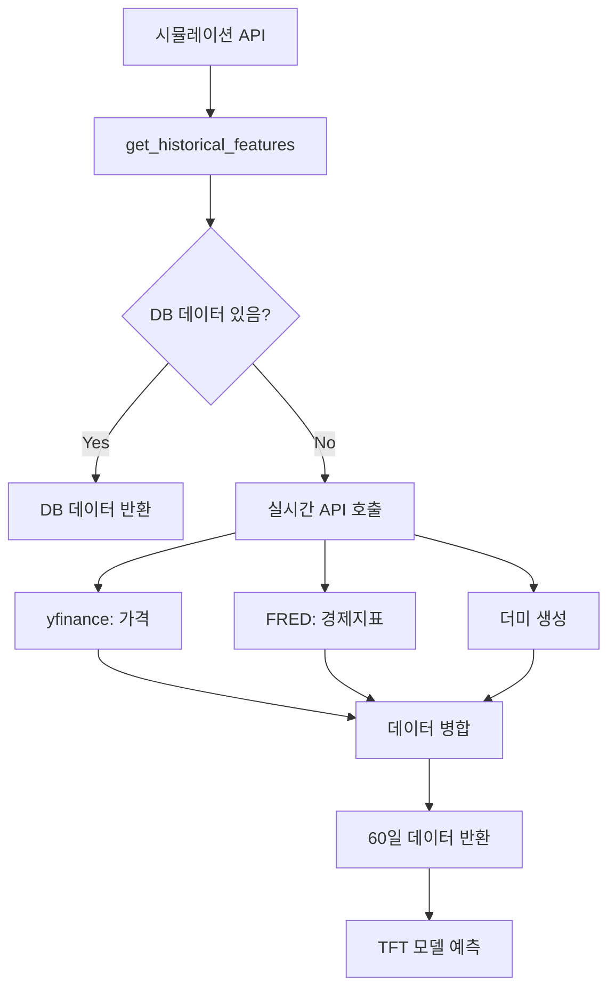

# 실시간 데이터 수집 설정 가이드

이 프로젝트는 DB가 비어있을 때 **실시간으로 외부 API**에서 데이터를 가져와 시뮬레이션을 실행할 수 있습니다.

## 🎯 개요

`market_metrics` 테이블이 비어있어도 시뮬레이션 API(`/api/simulate`)가 정상 작동합니다.
- **실제 데이터**: yfinance (가격), FRED (경제 지표)
- **더미 데이터**: 뉴스 PCA, 기후 지표, Hawkes Intensity 등

## 📦 설치

### 1. 필수 패키지 설치

```bash
pip install -r requirements.txt
```

새로 추가된 패키지:
- `yfinance>=0.2.0`: 금융 데이터 (옥수수 선물 가격)
- `fredapi>=0.5.0`: 연준 경제 데이터 (금리, 달러 인덱스)
- `pandas>=1.5.0`: 데이터 처리

### 2. 환경 변수 설정 (선택 사항)

`.env` 파일에 추가:

```env
# FRED API 키 (선택사항, 없으면 더미 데이터 사용)
FRED_API_KEY=your_fred_api_key_here

# 데이터 수집 모드
DATA_FETCH_MODE=realtime
```

**FRED API 키 발급** (무료):
1. https://fred.stlouisfed.org/ 방문
2. 계정 생성 및 로그인
3. https://fred.stlouisfed.org/docs/api/api_key.html 에서 API 키 발급

> ⚠️ **참고**: FRED API 키가 없어도 시스템이 자동으로 더미 데이터로 폴백합니다.

## 🚀 사용법

### 서버 실행

```bash
uvicorn main:app --reload
```

### 시뮬레이션 API 테스트

```bash
python test_simulation_realtime.py
```

또는 직접 API 호출:

```bash
curl -X POST "http://localhost:8000/api/simulate" \
  -H "Content-Type: application/json" \
  -d '{
    "commodity": "corn",
    "base_date": "2026-02-07",
    "feature_overrides": {
      "10Y_Yield": 4.5,
      "USD_Index": 110.0
    }
  }'
```

### Market Metrics API 테스트

이제 `market-metrics` API도 실시간 데이터를 지원합니다:

```bash
# 오늘 날짜의 시장 지표 조회 (DB 없어도 작동)
curl "http://localhost:8000/api/market-metrics?commodity=corn&date=2026-02-08"
```

**응답 예시**:
```json
{
  "commodity": "corn",
  "date": "2026-02-08",
  "metrics": [
    {
      "metric_id": "close",
      "label": "종가",
      "value": "430.25",
      "numeric_value": 430.25,
      "trend": 0.0,
      "impact": "중립"
    },
    ...
  ]
}
```

## 📊 데이터 소스

### 실시간 API 데이터 (20개 feature)

| 데이터 | 소스 | Feature 개수 | 상태 |
|--------|------|--------------|------|
| 가격/거래량 | yfinance (ZC=F) | 6개 | ✅ 실시간 |
| 경제 지표 | FRED API | 2개 | ✅ 실시간 |
| 계산 변수 | 자동 생성 | 9개 | ✅ 자동 |

**가격 데이터** (6개):
- `close`: 종가
- `open`: 시가
- `high`: 고가
- `low`: 저가
- `volume`: 거래량
- `EMA`: 지수 이동 평균 (20일)

**경제 지표** (2개):
- `10Y_Yield`: 미국 10년물 국채 금리 (FRED: DGS10)
- `USD_Index`: 달러 인덱스 (FRED: DTWEXBGS)

**계산 변수** (9개):
- `time_idx`, `day_of_year`, `relative_time_idx`
- `encoder_length`, `close_center`, `close_scale`

### 더미 데이터 (32개 feature)

| 데이터 | Feature 개수 | 범위 |
|--------|--------------|------|
| 뉴스 PCA | 32개 | 정규분포 N(0, 1) |
| 기후 지수 | 3개 | pdsi: -6~6, spi: -3~3 |
| Hawkes Intensity | 2개 | 0~1 |
| 뉴스 카운트 | 1개 | 0~20 |

**총 52개 feature** (TFT 모델 요구사항)

## 🔧 구조

### 주요 파일

```
app/
├── data_fetcher.py              # 실시간 데이터 수집 모듈 (신규)
├── crud.py                      # get_historical_features() 수정
├── config.py                    # FRED_API_KEY 설정 추가
└── routers/
    └── market_metrics.py        # market-metrics API 실시간 데이터 지원 추가

tests/
├── test_realtime_api.py          # 데이터 수집 테스트
└── test_simulation_realtime.py   # 시뮬레이션 API 테스트
```

### 데이터 플로우



## ✅ 검증

### 1. 데이터 수집 테스트

```bash
python test_realtime_api.py
```

**기대 결과**:
- ✅ 가격 데이터 수집 성공 (60일)
- ✅ 경제 지표 수집 성공 (60일)
- ✅ 52개 feature 생성 완료

### 2. 시뮬레이션 API 테스트

```bash
python test_simulation_realtime.py
```

**기대 결과**:
- ✅ API 호출 성공 (200 OK)
- ✅ 60일 예측 생성
- ✅ Feature 영향도 계산 완료

### 3. 수동 테스트

Python 콘솔에서:

```python
from app.data_fetcher import fetch_realtime_features
from datetime import date

# 60일 데이터 수집
result = fetch_realtime_features(
    commodity="corn",
    end_date=date.today(),
    days=60
)

print(f"날짜: {len(result['dates'])}일")
print(f"Feature: {len(result['features'])}개")
```

## 🎯 성능

- **최초 호출**: 3-5초 (API 호출 포함)
- **캐싱 적용**: 즉시 반환 (같은 요청 시)
- **API 제한**:
  - yfinance: 무제한
  - FRED: 120 requests/minute

## 🔍 트러블슈팅

### 문제: "가격 데이터 수집 실패"

**원인**: yfinance API 오류

**해결**: 자동으로 더미 데이터로 폴백됨 (로그에 경고 표시)

### 문제: "FRED API 사용 불가"

**원인**: FRED_API_KEY 미설정 또는 잘못된 키

**해결**: 
1. `.env`에 올바른 API 키 설정
2. 또는 더미 데이터로 진행 (정상 작동)

### 문제: "시뮬레이션 API 타임아웃"

**원인**: 최초 데이터 수집 시 시간 소요

**해결**: 
- 타임아웃 늘리기 (60초)
- 캐싱 활성화 (자동)

## 📝 참고사항

### DB 저장 없이 작동

이 시스템은 **DB에 데이터를 저장하지 않습니다**.
- 장점: 설정 불필요, 항상 최신 데이터
- 단점: 최초 호출 시 레이턴시 (3-5초)

### DB 저장이 필요한 경우

만약 DB에 데이터를 미리 저장하고 싶다면:

```python
# scripts/populate_market_metrics.py 참고
# (별도로 제공되지 않음, 필요 시 작성 가능)
```

### 캐싱 정책

- LRU 캐시 (최대 128개 항목)
- 같은 commodity, date, days 조합은 캐시 반환
- 서버 재시작 시 캐시 초기화

## 🎉 완료!

이제 DB가 비어있어도 시뮬레이션 API가 정상 작동합니다!

**다음 단계**:
1. FRED API 키 발급 (선택)
2. 서버 실행
3. 시뮬레이션 API 호출
4. 실시간 데이터로 예측 확인
