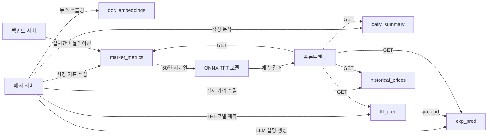

# Database Schema

## ERD (Entity Relationship Diagram)

```mermaid
erDiagram
    doc_embeddings {
        bigint id PK
        varchar(255) title
        text content
        varchar(255) source_url
        timestamp created_at
        vector(1536) embedding
    }

    daily_summary {
        int id PK
        date target_date
        varchar(50) commodity
        numeric(5,4) score
        bigint[] related_news_ids
        timestamp created_at
    }

    tft_pred {
        int id PK
        date target_date
        varchar(50) commodity
        numeric(10,2) price_pred
        numeric(10,2) conf_lower
        numeric(10,2) conf_upper
        varchar(255) top1_factor
        float top1_impact
        varchar(255) top2_factor
        float top2_impact
        varchar(255) top3_factor
        float top3_impact
        varchar(255) top4_factor
        float top4_impact
        varchar(255) top5_factor
        float top5_impact
        varchar(255) top6_factor
        float top6_impact
        varchar(255) top7_factor
        float top7_impact
        varchar(255) top8_factor
        float top8_impact
        varchar(255) top9_factor
        float top9_impact
        varchar(255) top10_factor
        float top10_impact
        varchar(255) top11_factor
        float top11_impact
        varchar(255) top12_factor
        float top12_impact
        varchar(255) top13_factor
        float top13_impact
        varchar(255) top14_factor
        float top14_impact
        varchar(255) top15_factor
        float top15_impact
        varchar(255) top16_factor
        float top16_impact
        varchar(255) top17_factor
        float top17_impact
        varchar(255) top18_factor
        float top18_impact
        varchar(255) top19_factor
        float top19_impact
        varchar(255) top20_factor
        float top20_impact
        varchar(255) model_type
        timestamp created_at
    }

    exp_pred {
        int id PK
        int pred_id FK
        text content
        varchar(50) llm_model
        json impact_news
        timestamp created_at
    }

    market_metrics {
        int id PK
        varchar(50) commodity
        date date
        varchar(50) metric_id
        varchar(255) label
        varchar(50) value
        float numeric_value
        float trend
        varchar(20) impact
        timestamp created_at
    }

    historical_prices {
        int id PK
        varchar(50) commodity
        date date
        numeric(10,2) actual_price
        timestamp created_at
    }

    tft_pred ||--o| exp_pred : "has one explanation"
```

## 테이블 설명

### 1. doc_embeddings
뉴스 문서 및 임베딩 저장
- **용도**: RAG 기반 뉴스 검색
- **주요 컬럼**:
  - `embedding`: 1536차원 벡터 (OpenAI Ada-002)
  - `source_url`: 뉴스 원문 URL

### 2. daily_summary
일별 뉴스 요약 및 감성 점수
- **용도**: 일별 시장 심리 분석
- **주요 컬럼**:
  - `score`: 감성 점수 (-1 ~ 1)
  - `related_news_ids`: 관련 뉴스 문서 ID 배열

### 3. tft_pred
TFT 모델 예측 결과 (시계열 예측)
- **용도**: 가격 예측 및 주요 영향 요인 저장
- **주요 컬럼**:
  - `price_pred`: 예측 가격
  - `conf_lower`, `conf_upper`: 신뢰 구간
  - `top1_factor ~ top20_factor`: 상위 20개 영향 요인 (이름)
  - `top1_impact ~ top20_impact`: 각 요인의 영향도 (수치)
  - `model_type`: 모델 타입 (예: "TFT")
- **인덱스**: `target_date`, `commodity`
- **관계**: `exp_pred`와 1:1 관계

### 4. exp_pred
예측 설명 (LLM 생성)
- **용도**: 예측에 대한 자연어 설명 제공
- **주요 컬럼**:
  - `pred_id`: `tft_pred.id` 외래키
  - `content`: 설명 텍스트
  - `llm_model`: 사용된 LLM 모델명
  - `impact_news`: 영향력 있는 뉴스 메타데이터 (JSON)
- **관계**: `tft_pred`와 1:1 관계

### 5. market_metrics
시장 지표 및 거시경제 데이터 (60일 시계열)
- **용도**: TFT 모델 입력 feature 저장 (52개 feature)
- **주요 컬럼**:
  - `metric_id`: 지표 식별자 (예: "10Y_Yield", "USD_Index", "news_pca_0")
  - `label`: 지표 한글명
  - `value`: 문자열 값
  - `numeric_value`: 수치 값
  - `trend`: 변화 추세
  - `impact`: 영향 수준 ("상승", "하락", "중립")
- **인덱스**: `commodity`, `date`
- **Feature 구성** (52개):
  - 정적 변수 (3개): encoder_length, close_center, close_scale
  - Known 시계열 (3개): time_idx, day_of_year, relative_time_idx
  - Unknown 시계열 (46개):
    - 가격/거래량 (6개): close, open, high, low, volume, EMA
    - 뉴스 PCA (32개): news_pca_0 ~ news_pca_31
    - 기후 지수 (3개): pdsi, spi30d, spi90d
    - 거시경제 (2개): 10Y_Yield, USD_Index
    - Hawkes Intensity (2개): lambda_price, lambda_news
    - 기타 (1개): news_count

### 6. historical_prices
과거 실제 가격 데이터
- **용도**: 예측 성능 평가 및 차트 표시
- **주요 컬럼**:
  - `actual_price`: 실제 거래 가격
- **인덱스**: `commodity`, `date`

## 데이터 흐름



## 인덱스 전략

### 복합 인덱스
- `tft_pred`: `(commodity, target_date)`
- `market_metrics`: `(commodity, date, metric_id)`
- `historical_prices`: `(commodity, date)`
- `daily_summary`: `(commodity, target_date)`

### 단일 인덱스
- 모든 테이블의 `id` (PK)
- 모든 시계열 테이블의 `created_at`

## 데이터 보관 정책

| 테이블 | 보관 기간 | 정책 |
|--------|-----------|------|
| `tft_pred` | 90일 | 90일 이전 데이터는 아카이브 |
| `exp_pred` | 90일 | `tft_pred`와 동일 |
| `market_metrics` | 365일 | 1년 이전 데이터는 아카이브 |
| `historical_prices` | 무제한 | 영구 보관 |
| `daily_summary` | 180일 | 6개월 이전 데이터는 아카이브 |
| `doc_embeddings` | 180일 | 6개월 이전 데이터는 아카이브 |

## 스키마 버전

- **버전**: 2.0
- **마지막 업데이트**: 2026-02-08
- **주요 변경사항**:
  - `tft_pred`: top 5 → top 20 factors 확장
  - `market_metrics`: 52개 feature 지원 추가
  - `historical_prices`: 휴장일 처리 개선
